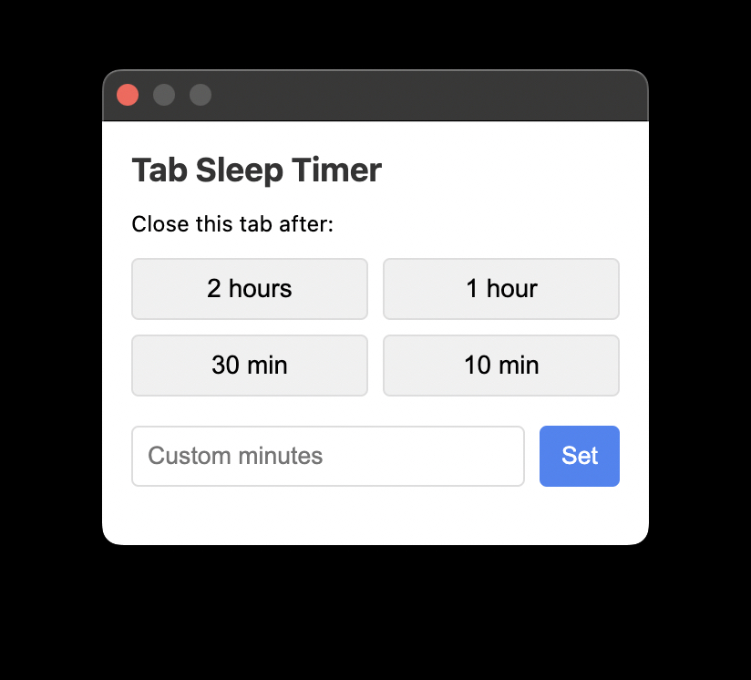
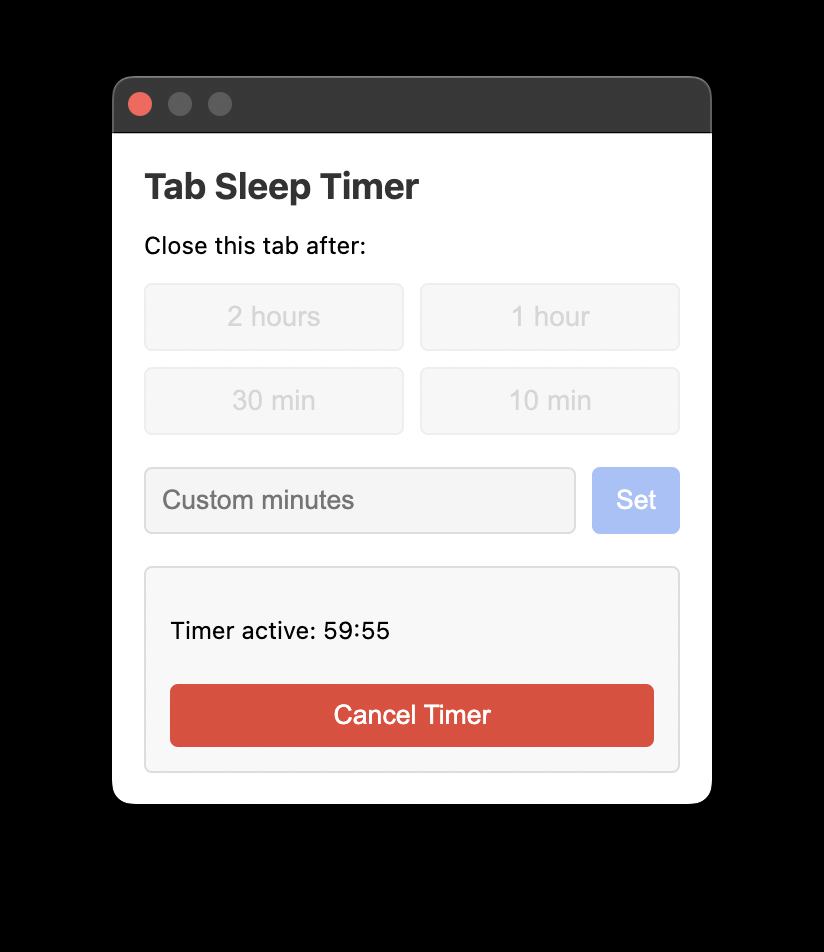
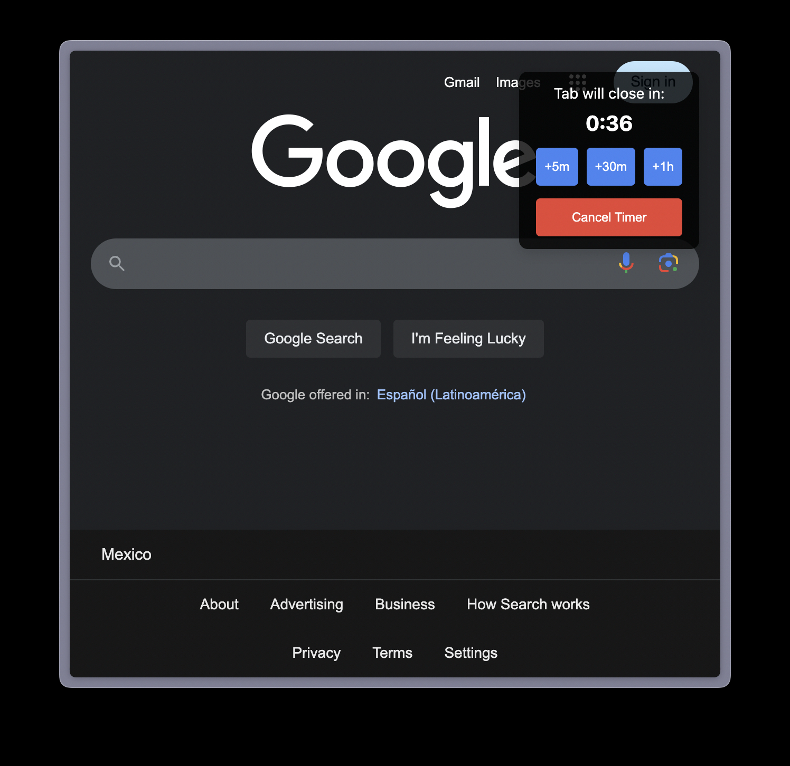

# Tab Sleep Timer Chrome Extension

A Chrome extension that automatically closes tabs after a set period of time, similar to the Apple TV sleep timer.

## Features

- Set a timer to close the current tab after a specified duration
- Preset timer options: 2 hours, 1 hour, 30 minutes, 10 minutes
- Custom timer option (1-1440 minutes)
- Countdown notification appears in the upper-right corner of the page when 1 minute remains, allowing you to extend (by 5m, 30m, or 1h) or cancel the timer
- Cancel the timer at any time
- Timer persists even if you navigate away from the page or restart the browser

## Screenshots

## Installation

### From Chrome Web Store

1. Click <a href="https://chromewebstore.google.com/detail/tab-sleep-timer/bncbklpmnbgbpnfdgkbahglbjmkcpmjd" target="_blank">here</a> to install

OR

1. Visit the Chrome Web Store
2. Search for "Tab Sleep Timer"
3. Click "Add to Chrome"

### Manual Installation (Developer Mode)

1. Download or clone this repository
2. Open Chrome and navigate to `chrome://extensions/`
3. Enable "Developer mode" in the top-right corner
4. Click "Load unpacked" and select the extension directory
5. The extension should now appear in your toolbar

## Usage

1. Navigate to the tab you want to close automatically
2. Click the Tab Sleep Timer icon in your Chrome toolbar
3. Select a preset timer or enter a custom duration
4. A confirmation will appear showing the active timer
5. When 1 minute remains, a countdown will appear in the upper-right corner of the page
6. To extend the timer, click "+5m", "+30m", or "+1h" on the countdown notification
7. To cancel the timer, click the "Cancel Timer" button in either the popup or the countdown notification

## License

MIT
